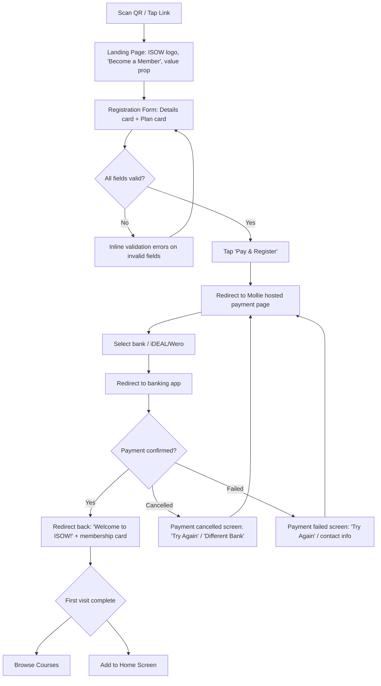
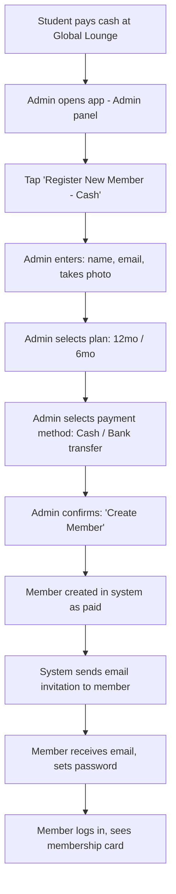
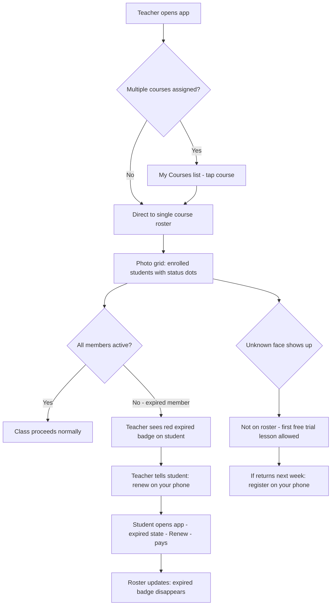
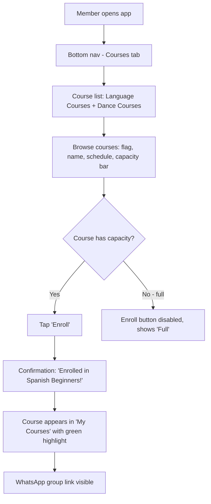
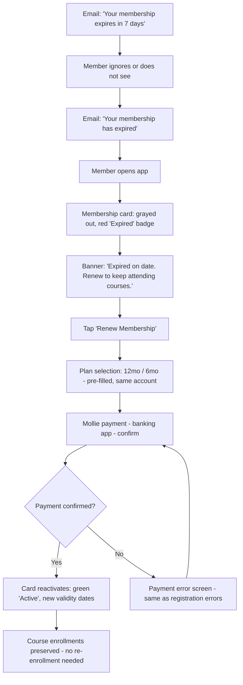
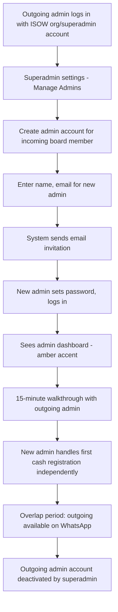

# UX Design Specification isow_registration_app

**Author:** Cedric
**Date:** 2026-04-11

---

## Executive Summary

### Project Vision

ISOW Registration & Course App replaces a fragmented, manual process — Google Forms, bank transfers, in-person card pickup, spreadsheet rosters — with a single mobile-first Progressive Web App. The core promise: a new member registers, uploads a photo, pays via iDEAL, and has a digital membership card in under 5 minutes, entirely from their phone. Teachers see a photo roster they can trust. The board inherits a working system instead of undocumented spreadsheets. The design philosophy is "institutional memory as software" — every UX decision must survive a complete board replacement every 6 months.

### Target Users

**New members (primary):** International students at Wageningen University. Mobile-first, expect modern frictionless experiences. Many are newly arrived, possibly without a Dutch bank account (cash fallback needed). Peak registration happens during orientation week — hundreds in days. They need to go from stranger to paid member with a digital card in one sitting.

**Teachers (secondary, high-frequency):** Volunteer course instructors checking rosters before class on their phones. They use the app weekly — the most consistent touchpoint. Their needs are narrow but critical: see who's enrolled, see faces, spot expired members. If the roster is delightful, teachers become the adoption flywheel that keeps the board using the app across turnovers.

**Board admins (secondary, operational):** Volunteers managing members, courses, and payments. They rotate every 6 months with minimal overlap. The admin panel must be self-explanatory — no training manual, no handover documentation beyond a 15-minute walkthrough. Day-to-day tasks are simple; quarterly course setup is the most complex operation.

**Superadmin (ISOW org account):** Not a person but a role — the organizational account that persists across board turnovers. Used for admin account management, system settings, and credential continuity via shared password manager.

### Key Design Challenges

1. **Orientation week stress test** — Peak registration volume with impatient, distracted users on mobile. The flow must be completable in ~3 minutes, resilient to interruptions, and instantly clear without onboarding.
2. **Teacher's "5 minutes before class" moment** — Roster must load fast on mobile, display photos at scannable size, and make membership status (active/expired) visible at a glance. Zero learning curve.
3. **Board turnover every 6 months** — Admin UX must be self-explanatory for someone who just joined the board. Progressive disclosure: simple daily tasks visible, complex settings tucked away.
4. **Dual registration paths** — Self-service iDEAL and admin-created cash registrations must produce identical member experiences. Two entry points, one unified system.

### Design Opportunities

1. **"Show Membership" as daily touchpoint** — The membership card screen is used at partner business counters for discounts (5-30% off at local shops). Making it instant (<500ms), visually clear, and optimized for showing at a counter turns every discount moment into a positive brand experience.
2. **Photo-first roster** — A visual grid of faces instead of a text list makes the teacher's job human and personal. This is the feature that makes teachers love the app and advocate for it.
3. **Progressive disclosure admin panel** — Calm, focused admin UX. Daily operations (glance at dashboard, handle a cash registration) are front and center. Quarterly tasks (course setup) and system settings are accessible but not overwhelming. The admin panel should feel like "everything is fine" at first glance.

## Core User Experience

### Defining Experience

The app serves three fundamentally different usage patterns:

**Members** interact with the app in rare, high-stakes moments — registration (once), course enrollment (a few times per year), renewal (once per membership period), and occasionally showing their membership card at partner businesses. Between these moments, the app is invisible. This means every interaction is effectively a first-time experience — screens must be self-evident without any memory of previous visits.

**Teachers** are the only high-frequency users, checking the roster weekly before class. Their experience must be optimized for speed and glanceability — this is the feature that sustains adoption across board turnovers.

**Admins** operate in bursts — quarterly course setup, occasional cash registrations, periodic dashboard glances. The admin panel must be calm and self-explanatory for someone who just joined the board.

### Platform Strategy

- **Mobile-first PWA** — no install required, accessed via QR code or direct link from the ISOW website
- **Touch-optimized** — all core flows designed for one-handed phone use
- **No offline mode** — all meaningful actions require network (payment, enrollment, roster data)
- **Photo upload from device** — standard file picker that offers both gallery selection and camera capture on mobile. Members choose whichever is more convenient. No custom camera UI needed — the browser's native picker handles it
- **"Add to Home Screen"** via PWA manifest for app-like access, but the experience must work equally well as a browser tab
- **Desktop as secondary** — admin panel and roster should work on larger screens, but mobile is the primary design target

### Effortless Interactions

**Registration flow:** QR scan or link tap to paid member in ~3 minutes. No account creation before payment decision — the flow is: name/email/photo, pick plan, pay, done. Every field and step must be obvious to a distracted student at an orientation week booth.

**Course enrollment:** Member returns after weeks or months. Browse courses, see availability, tap enroll. No relearning needed — the course list and enrollment action must be immediately parseable.

**Roster check:** Teacher opens app, taps their course, sees photo grid of enrolled students with membership status. Under 3 seconds from app open to roster visible.

**Show membership:** Member opens app, sees membership card with photo and validity. Optimized for handing phone to someone at a counter — large photo, clear name, obvious valid/expired status.

**Renewal:** Expired member logs in, sees clear "expired" state and renewal prompt. Same payment flow as initial registration — pick plan, pay, done. No re-entering profile information.

### Critical Success Moments

1. **Registration completion** — The moment payment confirms and the member sees their digital card for the first time. This is when trust is earned. If the redirect fails or the confirmation is unclear, the member may never return.
2. **First roster check** — The first time a teacher opens the roster and sees enrolled students with photos. If it's fast and clear, the teacher becomes an advocate. If it's slow or confusing, they fall back to informal methods.
3. **Return visit after months** — A member opens the app for course enrollment weeks or months after registration. If they can find courses and enroll without confusion, the app has succeeded at being "invisible when not needed." If they're lost, the infrequent-use design has failed.
4. **Board handover moment** — A new admin logs in for the first time. If the dashboard is self-explanatory and they can handle a cash registration within minutes, zero-handover operations is achieved.

### Experience Principles

1. **First-time clarity** — Every screen works for someone who has never seen it before, because most interactions are effectively first-time experiences (or feel like it after months away). No hidden menus, no learned gestures, no memory required.
2. **One job per screen** — Registration registers. Roster shows faces. Membership card shows membership. Each screen has a single clear purpose with a single primary action.
3. **Teacher-grade reliability** — The weekly roster check is the app's heartbeat. It must be fast, trustworthy, and delightful. If teachers rely on it, they pressure every new board to keep using the app.
4. **Invisible when not needed** — Members should not think about the app between registration and course enrollment. No engagement notifications, no activity feeds, no reasons to open it unless they need something specific. The best UX for infrequent users is no UX until the moment they need it.

## Desired Emotional Response

### Primary Emotional Goals

**"That was surprisingly easy."** — The dominant feeling across all user types. In a context where the previous process involved forms, bank transfers, office visits, and physical cards, the app should feel like a breath of fresh air. Not impressive or flashy — just effortlessly simple.

**"I trust this."** — Payment is involved, personal photos are uploaded, and the membership card is shown to strangers at shop counters. The app must feel official, safe, and legitimate at every touchpoint.

**"I've got this."** — For admins encountering the system for the first time, and for members returning after months. The feeling of quiet competence — the interface tells you what to do without making you feel like you need to be taught.

### Emotional Journey Mapping

| Moment | Target Emotion | Design Implication |
|---|---|---|
| First contact (registration) | Confidence, ease | Minimal fields, clear progress, no surprises |
| Payment | Trust, safety | Official iDEAL branding, clear amount, instant confirmation |
| Registration complete | Accomplishment, small win | Show the membership card immediately — tangible proof of success |
| Return visit (course enrollment) | Instant familiarity | Consistent layout, obvious navigation, no relearning |
| Roster check (teacher) | Professional reliability | Fast load, clean grid, status visible at a glance |
| Show membership (at counter) | Pride, zero awkwardness | Large photo, clear name/dates, obvious valid status |
| Admin first login | Calm control | Clean dashboard, progressive disclosure, no information overload |
| Something goes wrong | Clarity, not panic | Specific error messages, clear next steps, no dead ends |

### Micro-Emotions

**Confidence vs. Confusion** — The most critical axis. Every screen must answer "where am I?" and "what do I do next?" within seconds. Confusion is the primary emotion to eliminate — it's what the old process was built on.

**Trust vs. Skepticism** — Payment and personal data demand trust. Visual cues: clean design, official payment provider branding, HTTPS indicators, clear privacy messaging. The membership card must look legitimate when shown to a shop employee who's never seen it before.

**Accomplishment vs. Frustration** — Registration completion should feel like a small win ("I'm officially a member now") not relief ("finally that's over"). The digital card appearing immediately after payment is the key moment.

### Design Implications

- **Clean, uncluttered layouts** — Confidence comes from visual clarity. White space is not wasted space; it's a signal that says "this is simple."
- **Official visual tone** — Not playful or startup-y. Not corporate or cold. Professional-friendly: clean typography, ISOW branding, consistent color use. The app represents a real organization.
- **Instant feedback** — Every action produces a visible response. Button taps show loading states. Payment confirms visibly. Enrollment updates the list. No ambiguity about whether something worked.
- **Error states that guide** — "Payment was cancelled. You can try again or choose a different bank." Not "Error 500" or a blank screen. Every error is a conversation, not a wall.
- **Progressive disclosure for complexity** — Show only what's needed for the current task. Course setup fields appear when creating a course, not on the dashboard. System settings are behind a clearly labeled door, not scattered across the interface.

### Emotional Design Principles

1. **Clarity is kindness** — Every moment of confusion is a small failure. Invest in clear labels, obvious actions, and predictable layouts over clever interactions or visual flair.
2. **Trust is earned in pixels** — Clean design, proper spacing, consistent components, and official payment branding build trust faster than any trust badge or privacy banner.
3. **Completion is celebration** — When a user finishes registration, enrollment, or renewal, mark the moment. Show the result (membership card, enrollment confirmation) immediately and clearly.
4. **Errors are conversations** — When something goes wrong, the app explains what happened, why, and what to do next. No jargon, no codes, no dead ends.

## UX Pattern Analysis & Inspiration

### Inspiring Products Analysis

**Dutch iDEAL/Wero subscription services (Netflix NL, Thuisbezorgd, Bol.com, NS):**
These services have trained Dutch residents — including international students — to expect a specific payment flow: choose product, see price, select bank, confirm in banking app, return to confirmation screen. The entire transaction is 3-4 taps with zero ambiguity. ISOW's registration should feel identical to this pattern — students already know how iDEAL works, so the app should leverage that muscle memory rather than introducing novel flows. Note: iDEAL is transitioning to Wero (starting March 2026, full transition by end 2027). Mollie handles this transparently — the UX flow remains identical for users.

- **What they do well:** Payment is the final step of a clear linear flow. No account creation before the value proposition is clear. Confirmation is immediate and unambiguous.
- **Key lesson:** Don't fight the iDEAL/Wero convention. The bank selection screen, the redirect to the banking app, and the return to confirmation should look and feel exactly like every other iDEAL transaction students have done.

**Current ISOW website (isow-wageningen.com):**
The existing Squarespace site has a coral/red and white brand identity with black text — clean, modern, and welcoming. Good visual hierarchy with icon-based course cards, flag identifiers for languages, and a warm inclusive tone ("Dear International Students, Welcome"). But the registration experience is fragmented: an embedded Google Form (with a fallback link because the primary form is unreliable), bank transfer instructions, and a requirement to visit the Global Lounge during office hours to pick up a physical card. Course pages show schedules and WhatsApp links but have no inline enrollment mechanism.

- **What to preserve:** The welcoming, inclusive tone. The coral/red + white brand colors. The visual organization of courses by category (language/dance) with flag/icon identifiers. The clear presentation of schedule, location, and level per course.
- **What to replace:** Everything about the registration and payment flow. The Google Form dependency. The offline card pickup requirement. The absence of course enrollment.

### Transferable UX Patterns

**Linear payment flow (from iDEAL/Wero convention):**
Registration → plan selection → bank selection → banking app → confirmation. This is the flow every Dutch-based subscription uses. Members already understand it — adopt it exactly.

**Card-based course browsing (from ISOW website):**
The current site's visual organization of courses with icons, levels, and schedules works well. Translate this into interactive cards that include capacity indicators and an enroll action.

**Photo grid roster (from contact/team pages):**
Team pages across many apps and websites display people as photo grids with names and status badges. This pattern maps directly to the teacher roster — faces in a grid with membership status overlaid.

**Bottom navigation bar (from mobile-first PWAs):**
For the 3-4 core destinations members need (membership card, courses, profile), a persistent bottom nav bar provides instant access without hamburger menus. Teachers get a "My Courses" entry point that goes directly to their roster.

**Status badges (from project management tools):**
Clear, color-coded status indicators (active = green, expired = orange/red) overlaid on member photos in the roster. Borrowed from tools like Jira or GitHub where status is always visible at a glance.

### Anti-Patterns to Avoid

**Account creation walls before value is shown** — Don't make users create a username/password before they see what ISOW offers. The registration flow should show courses, pricing, and benefits before asking for personal details.

**Multi-step registration with save-and-continue** — The flow is short enough (name, email, photo, plan, pay) to be a single continuous sequence. Adding "save progress" or step indicators for 3-4 fields creates more overhead than it removes.

**Hamburger menus for primary navigation** — On mobile, hiding core actions behind a hamburger menu adds a tap to every interaction. Use a visible bottom navigation bar for the 3-4 most common destinations.

**Dashboard overload for admins** — Admin panels that show everything at once (charts, tables, alerts, shortcuts) create decision paralysis. Show member count and last backup timestamp. Everything else is one tap away, not on the landing screen.

**Engagement notifications for an infrequent-use app** — Push notifications, email digests, or "come back" prompts are anti-patterns for an app members use a few times per year. The only notifications should be transactional: payment confirmation, expiry warning, account invitation.

### Design Inspiration Strategy

**Adopt directly:**
- iDEAL/Wero payment flow convention — identical to what students already know from Dutch services
- Card-based course display with visual identifiers (flags/icons), schedule, level, and capacity
- Photo grid layout for teacher roster with status badges
- Bottom navigation bar for mobile primary navigation

**Adapt for ISOW:**
- The welcoming tone from the current website — carry it into the app's registration flow and empty states
- Course organization by category (language/dance) — adapt from static pages to interactive, enrollable cards
- The coral/red brand identity from the current site as the member accent color in the app

**Avoid:**
- Account creation walls before showing value
- Hamburger-only navigation on mobile
- Multi-step wizards for simple flows
- Dashboard overload in admin panel
- Engagement/retention notifications

## Design System Foundation

### Design System Choice

**Tailwind CSS + DaisyUI** — a themeable component library that provides pre-built, accessible UI components (buttons, cards, modals, forms, badges, navigation) with full theme customization via CSS variables. No JavaScript framework dependency — works directly with Django templates and HTMX.

### Rationale for Selection

- **Already decided in tech stack** — PRD and reference stack specify Tailwind + DaisyUI. Proven in the developer's tree_manager_app.
- **Solo developer, zero maintenance** — Pre-built components eliminate the need for a custom component library. DaisyUI handles accessibility defaults, focus states, and responsive behavior.
- **Themeable** — ISOW branding applied globally via DaisyUI theme configuration. Role-based accent colors achievable through CSS variable overrides per role context.
- **Lightweight** — No client-side framework. Components are CSS-only with optional JavaScript for interactive elements (handled by HTMX).

### Implementation Approach

**Light theme with ISOW brand identity:**
- **Background:** White/off-white base across all roles — clean, readable, professional
- **Primary brand color:** ISOW coral/red (from website and logo) — the core brand identity carried into the app
- **Text:** Black/dark gray for readability
- **Logo accent:** Globe green/blue from the ISOW logo as a secondary color where appropriate

**Role-based accent colors:**
Accent colors shift based on the logged-in user's role, applied to buttons, active navigation indicators, highlights, and interactive elements. The page background remains white across all roles — the role is communicated through accent color, not through ambient page color.

| Role | Accent Color | Applied To |
|---|---|---|
| Member (student) | ISOW coral/red | Primary buttons, active nav, links |
| Teacher | Blue/teal | Primary buttons, active nav, roster highlights |
| Admin | Amber/warm | Primary buttons, active nav, admin panel highlights |
| Superadmin | Same as admin | Inherits admin accent |

This creates an immediate ambient signal of "which mode am I in" without requiring the user to read a label or check a badge.

**Status colors (consistent across all roles):**
- Active/valid membership: Green
- Expired membership: Orange/red badge
- Error states: Red
- Success confirmations: Green

### Customization Strategy

**DaisyUI theme configuration:**
Define a custom ISOW theme in `tailwind.config.js` with role-based variants. DaisyUI's theme system allows defining multiple named themes that swap CSS variables — the active theme can be set server-side based on the user's role via a class on the `<html>` element.

**Component usage:**
- Use DaisyUI components as-is wherever possible (buttons, cards, badges, navbar, form inputs, modals, alerts)
- Custom styling only where DaisyUI doesn't provide the pattern (photo grid roster, membership card display)
- No custom component library — extend DaisyUI with Tailwind utility classes for one-off adjustments

**Typography:**
- System font stack (no custom web fonts) — fastest load time, familiar to users, zero font hosting
- Clear hierarchy: large headings for page titles, medium for section labels, regular for body text

## Defining Core Experience

### Defining Interaction

**"Scan, register, paid — you're a member."**

The defining experience is the registration flow — the moment that replaces a broken, multi-day process (Google Form → bank transfer → office visit → physical card) with a 3-minute phone interaction. If this works, everything else follows: the member database is trustworthy, teachers can rely on rosters, and the board doesn't manage manual processes.

### User Mental Model

Students bring the universal online checkout mental model: "I pick something, I pay, I'm done." This is reinforced by every subscription service and e-commerce site they've used — regardless of their country of origin. For students who've been in the Netherlands, iDEAL/Wero is already familiar. For newly arrived international students, the flow mirrors any standard online payment experience.

The current ISOW process violates this mental model at every step — form submission without payment, separate bank transfer, in-person card pickup. The app collapses these into the expected single-session flow.

**Key mental model expectations:**
- One session, start to finish — no "come back later" steps
- Payment completes the process — no pending states, no follow-up
- Immediate proof of purchase — the digital card appears right after payment
- No training or instructions needed — the flow explains itself

### Success Criteria

- Registration completable in under 5 minutes on a phone, including photo upload and payment
- Zero guidance needed — a student at a noisy orientation week booth can complete it without help
- Payment confirmation is immediate and unambiguous — no "check your email" or "wait for processing"
- The membership card is the first thing the member sees after payment — tangible proof of success
- A member who abandons mid-flow and returns later can restart cleanly without confusion

### Novel UX Patterns

No novel patterns needed — this is entirely built on established conventions:

- **Online checkout flow** — universal: select product → enter details → pay → confirmation. Every e-commerce site uses this.
- **iDEAL/Wero payment** — standard in the Netherlands: select bank → redirect to banking app → confirm → return. Handled by Mollie's hosted payment page.
- **Photo upload** — standard file picker with gallery and camera options. No custom UI.
- **Digital card display** — simple profile card with photo, name, dates. No innovation needed — clarity is the feature.

The unique twist is not in the interaction pattern but in what it replaces: a multi-day, multi-step, multi-channel process compressed into one flow that takes 3 minutes. The innovation is elimination, not invention.

### Experience Mechanics

**1. Initiation:**
Student scans QR code on a flyer/poster or taps a link from the ISOW website. Lands on a clean page: ISOW logo, "Become a Member", brief value proposition (free courses, partner discounts, community). No login wall — registration is the first action available.

**2. Interaction:**
Single scrollable form on one page:
- Name, email, password
- Photo upload (tap to select from gallery or take photo)
- Plan selection: 12-month (EUR 20) or 6-month (EUR 12.50) — two clear options, no decision fatigue
- GDPR consent checkbox
- "Pay & Register" button

Tap "Pay & Register" → Mollie hosted payment page (bank selection for iDEAL/Wero) → redirect to banking app → confirm payment → redirect back to app.

**3. Feedback:**
Return to confirmation screen: "Welcome to ISOW!" with their photo displayed on a membership card. Green checkmark. Membership valid from [date] to [date]. The card is the confirmation — no separate "success" page needed.

**4. Completion:**
Member is looking at their digital membership card — the tangible proof they're done. Below the card: "Browse Courses" link to explore and enroll. "Add to Home Screen" prompt for quick access later. The next natural action (course enrollment) is one tap away.

## Visual Design Foundation

### Color System

**Brand colors (from isow-wageningen.com):**

| Token | Value | Usage |
|---|---|---|
| ISOW Coral/Red | #FF5757 | Primary brand — header, primary buttons, key accents |
| White | #FFFFFF | Page background, nav text, text on coral |
| Black/Dark | ~#1A1A1A | Body text, headings |

**Role-based accent colors:**

| Role | Accent | Approximate Value |
|---|---|---|
| Member | ISOW coral/red | #FF5757 |
| Teacher | Blue/teal | ~#2B8A9E |
| Admin | Amber/warm | ~#D97706 |

**Semantic colors (consistent across roles):**

| Token | Value | Usage |
|---|---|---|
| Success | Green (~#22C55E) | Active membership, payment confirmed, enrollment success |
| Warning | Amber (~#F59E0B) | Expiry approaching |
| Error/Expired | Red (~#EF4444) | Expired badge, payment failed, form errors |
| Info | Blue (~#3B82F6) | Informational messages, links |

**Contrast compliance:**
All text-on-background combinations must meet WCAG AA minimum (4.5:1 for body text, 3:1 for large text). White text on #FF5757 needs verification — if contrast is insufficient, use dark text or darken the coral slightly for text-bearing surfaces.

### Typography System

**Font stack:** System fonts — no custom web fonts, matching the clean sans-serif feel of the ISOW website.

```css
font-family: -apple-system, BlinkMacSystemFont, "Segoe UI", Roboto, "Helvetica Neue", Arial, sans-serif;
```

**Type scale (mobile-first):**

| Level | Size | Weight | Usage |
|---|---|---|---|
| Page title (h1) | 1.75rem (28px) | Bold (700) | Page headings: "Become a Member", "Courses" |
| Section heading (h2) | 1.25rem (20px) | Semibold (600) | Section labels: "Language Courses", "Your Membership" |
| Card title (h3) | 1.125rem (18px) | Semibold (600) | Course names, member names on roster |
| Body | 1rem (16px) | Regular (400) | Form labels, descriptions, body text |
| Small/caption | 0.875rem (14px) | Regular (400) | Timestamps, secondary info, helper text |
| Badge/label | 0.75rem (12px) | Medium (500) | Status badges, tags |

**Line height:** 1.5 for body text, 1.25 for headings. Sufficient for readability on mobile screens.

### Spacing & Layout Foundation

**Spacing approach:** Generous for member-facing flows (registration, enrollment, membership card), moderate for data-dense views (roster, admin member list, course lists).

**Base unit:** 4px (Tailwind default). Common spacing values:

| Token | Value | Usage |
|---|---|---|
| xs | 4px (1) | Inline icon gaps, badge padding |
| sm | 8px (2) | Between related elements within a component |
| md | 16px (4) | Between components, card padding |
| lg | 24px (6) | Between sections, form field spacing |
| xl | 32px (8) | Page-level section separation |
| 2xl | 48px (12) | Major section dividers |

**Touch targets:** Minimum 44x44px for all interactive elements (buttons, links, form inputs). Generous for primary actions (full-width buttons on mobile).

**Layout principles:**
- **Mobile:** Single column, full-width cards, stacked form fields. No side-by-side elements except plan selection (two cards)
- **Desktop:** Max content width ~768px centered (the app doesn't need wide layouts). Admin tables can expand wider
- **Bottom nav:** Fixed bottom, 56-64px height, 4-5 items max

**Grid system:** Tailwind's responsive grid. Mobile: 1 column. Tablet/desktop: 2-3 columns for course cards and roster photo grid. Admin member list: responsive table.

### Accessibility Considerations

- **Color contrast:** All text meets WCAG AA (4.5:1 body, 3:1 large text). Status colors never used as the sole indicator — always paired with text labels or icons (e.g., expired badge uses both orange/red color AND "Expired" text)
- **Focus states:** Visible focus rings on all interactive elements (DaisyUI default). High contrast for keyboard navigation
- **Touch targets:** 44px minimum, generous spacing between tappable elements to prevent mis-taps
- **Semantic HTML:** Proper heading hierarchy (h1->h2->h3), form labels associated with inputs, alt text on photos (member name)
- **Reduced motion:** Respect `prefers-reduced-motion` — no essential animations, loading states use opacity changes rather than spinners if motion is reduced

## Design Direction Decision

### Design Directions Explored

Six design direction mockups were generated as an interactive HTML showcase (`ux-design-directions.html`) covering all key screens: registration, membership card, courses, teacher roster, admin panel, and states/feedback. Each mockup was built with the established visual foundation — ISOW coral/red (#FF5757), role-based accent colors, system fonts, and DaisyUI components.

### Chosen Direction

**Registration:** Direction B — Compact card sections. Same single-page flow with fields grouped into visual cards ("Your Details" with photo/name/email side-by-side, "Membership Plan" as a separate card). More compact layout with less scrolling while maintaining the single-page checkout mental model.

**Membership card:** Full card display with coral header, large photo, name, status badge, and validity dates. Grayed-out version with red "Expired" badge and renewal prompt for expired state.

**Courses:** List view with flag icons, course name, schedule, location, capacity bar, and inline "Enroll" button. Enrolled courses highlighted with green border and WhatsApp group link visible.

**Teacher roster:** Photo grid (3 columns on mobile, expandable on desktop). Status dots on avatars (green = active, red = expired). Expired members highlighted with red background and "EXPIRED" label. Teal accent for teacher mode.

**Admin panel:** Progressive disclosure dashboard — stat cards (member count, recent registrations, active courses, expiring soon), last backup timestamp, and quick action buttons. Member management with search bar and filter badges (All/Active/Expired). Amber accent for admin mode.

**States/feedback:** Registration success shows green checkmark + membership card immediately. Payment errors show clear explanation, "Try Again" and "Choose a Different Bank" actions, and contact link.

### Design Rationale

- **Compact card registration** groups related fields visually (details card, plan card) while maintaining a single-page flow. The card grouping creates visual rhythm and reduces the feeling of a long form. Photo upload sits next to name/email for spatial efficiency.
- **Photo grid roster** optimizes for the teacher's core need: recognizing faces. A 3-column grid shows 9-12 students at a glance — enough for most ISOW classes. Status dots provide instant membership verification without reading text.
- **Progressive disclosure admin** keeps the dashboard calm. A new board member sees 4 numbers and 4 buttons — not overwhelming. Detailed management is one tap away.
- **Role-based accent colors** (coral/teal/amber) provide ambient mode awareness without requiring labels or mental model shifts between roles.

### Implementation Approach

- All mockups use DaisyUI components and Tailwind utility classes — no custom component library needed
- Responsive behavior: mobile single-column layouts expand to multi-column on desktop (course cards 2-col, roster grid 4-5 col, admin tables get more columns)
- Bottom navigation on mobile transitions to top navbar on desktop via responsive breakpoints
- Interactive elements (enroll/unenroll, roster refresh) use HTMX for partial page updates without full reload
- The HTML showcase file serves as a visual reference during implementation — not a pixel-perfect spec, but a clear direction

## User Journey Flows

### Journey 1: New Member Self-Registration

**Trigger:** Student scans QR code on flyer or taps link from ISOW website.



**Screen sequence:**
1. Landing page — ISOW branding, value proposition, "Become a Member" button or scroll to form
2. Registration form — compact card layout (Direction B): Details card (name, email, password, photo), Plan card (12mo/6mo), GDPR consent, "Pay & Register"
3. Mollie payment page — bank selection (handled by Mollie, not our UI)
4. Banking app — confirmation (handled by bank, not our UI)
5. Success screen — green checkmark, "Welcome to ISOW!", membership card displayed immediately
6. Post-registration — "Browse Courses" and "Add to Home Screen" actions

**Error recovery:**
- Form validation: inline errors per field, no page reload
- Payment cancelled: clear message, "Try Again" (same bank) or "Choose a Different Bank"
- Payment failed: clear message, "Try Again", contact email for edge cases
- Abandoned mid-flow: student can return to registration page and start fresh (no partial state saved)

### Journey 2: Manual/Cash Registration (Admin)

**Trigger:** Student visits Global Lounge, pays cash. Board member opens admin panel.



**Screen sequence:**
1. Admin dashboard (amber accent) -> "Register New Member (Cash)" button
2. Admin registration form — name, email, photo (taken on the spot), plan selection, payment method
3. Confirmation — member created, email invitation sent
4. Member receives email -> sets password -> logs in -> sees card

**Variant — Teacher onboarding:** Same flow but admin skips payment (teacher exemption), creates account, then promotes member to teacher role via member management. Teacher receives email invitation, sets password, sees roster for assigned courses.

### Journey 3: Teacher Roster Check

**Trigger:** Teacher opens app 5 minutes before class.



**Screen sequence:**
1. App opens -> bottom nav "Roster" tab (teal accent) -> course list or direct to roster
2. Roster: photo grid, 3 columns, status dots (green/red), course info header (name, time, location, enrolled count)
3. Expired member: red background highlight, "EXPIRED" label, red status dot

**Key UX details:**
- If teacher has only one course, skip course selection — go directly to roster
- Roster loads in under 3 seconds
- Expired members sort to the end of the grid (or highlighted in place)
- Page refresh updates enrollment changes without navigating away

### Journey 4: Course Enrollment (Returning Member)

**Trigger:** Active member opens app weeks/months after registration to enroll in a course.



**Screen sequence:**
1. Courses tab -> course list organized by category (Language/Dance)
2. Each course: flag icon, name, level, day/time, location, capacity bar, "Enroll" button
3. Tap "Enroll" -> inline confirmation (HTMX partial update, no page reload)
4. My Courses view: enrolled courses with green border, WhatsApp link, "Unenroll" option

**Unenroll flow:** Tap "Unenroll" -> confirmation dialog ("Are you sure?") -> removed from course -> course moves from "My Courses" back to available list.

### Journey 5: Expired Member Renewal

**Trigger:** Member's membership expires. They receive email notification or see expired state on login.



**Screen sequence:**
1. Login -> membership card screen with expired state (grayed card, red badge, banner)
2. "Renew Membership" button -> plan selection (same two options)
3. Mollie payment -> success -> card reactivates with new dates
4. Existing course enrollments preserved

**Key UX details:**
- No re-entering profile information — same account, same photo
- Course enrollments stay intact through renewal
- Expired members can still log in and see their profile but cannot enroll in new courses

### Journey 6: Board Handover

**Trigger:** New board takes over. Outgoing admin introduces incoming admin.



**Screen sequence:**
1. Superadmin -> settings -> "Manage Admins" -> "Create Admin Account"
2. Form: name, email -> system sends invitation
3. New admin receives email -> sets password -> logs in -> admin dashboard
4. After overlap period: superadmin deactivates outgoing admin account

### Journey Patterns

**Common patterns across all journeys:**

**Entry patterns:**
- Members always enter through bottom nav tabs (Card, Courses, Profile)
- Teachers enter through Roster tab (first in their bottom nav)
- Admins enter through Admin tab (first in their bottom nav)
- Unauthenticated users land on registration/login page

**Feedback patterns:**
- Success: green checkmark + immediate result display (card, enrollment confirmation)
- Error: red icon + plain language explanation + clear recovery action(s) + contact fallback
- Loading: button shows loading state during async operations (payment redirect, enrollment)

**Navigation patterns:**
- Bottom nav for primary destinations (3-4 tabs depending on role)
- Back navigation via browser back button / OS gesture (no custom back buttons needed)
- Inline actions where possible (enroll button in course list, not on detail page)

**Payment patterns:**
- Always redirect to Mollie hosted payment page (consistent, trusted, PCI-compliant)
- Return to app with clear success or failure state
- "Try Again" always available on failure — no dead ends

### Flow Optimization Principles

1. **Minimize taps to value** — Registration: ~6 taps from QR scan to paid member. Course enrollment: 2 taps from Courses tab to enrolled. Roster check: 1-2 taps from app open to roster visible.
2. **No dead ends** — Every error screen has at least one recovery action and a contact fallback. Every success screen has a clear next action.
3. **Inline over navigate** — Enrollment, unenrollment, and roster updates happen inline via HTMX. No navigating to detail pages for simple actions.
4. **Skip when possible** — Teachers with one course skip course selection. Renewal skips profile re-entry. Role-specific bottom nav shows only relevant tabs.
5. **Progressive information** — Show what's needed at each step. Course list shows enough to decide (name, time, capacity). Course detail only needed for more info. Admin dashboard shows overview; drill into details on demand.

## Component Strategy

### Design System Components (DaisyUI)

The following DaisyUI components are used as-is across the app, with ISOW theme colors applied via the custom DaisyUI theme configuration:

| Component | DaisyUI Class | Used In |
|---|---|---|
| Buttons | `btn`, `btn-primary`, `btn-outline` | All flows — primary actions, secondary actions |
| Form inputs | `input`, `select`, `checkbox` | Registration, admin forms, search |
| File input | `file-input` | Photo upload (wrapped in custom circle UI) |
| Cards | `card`, `card-body` | Registration form sections, course detail |
| Badges | `badge` + semantic variants | Status indicators (Active, Expired, Teacher) |
| Navbar | `navbar` | Top navigation on desktop |
| Bottom nav | `btm-nav` | Primary navigation on mobile |
| Alerts | `alert` + semantic variants | Success/error/warning messages |
| Modal | `modal` | Confirmation dialogs (unenroll, delete account) |
| Stats | `stat` | Admin dashboard numbers |
| Table | `table` | Admin member list (desktop) |
| Avatar | `avatar` | Member photos in roster and lists |
| Loading | `loading` | Async operation feedback |
| Divider | `divider` | Section separation |
| Dropdown | `dropdown` | Filter menus |

### Custom Components

Five custom components built with Tailwind utility classes on top of DaisyUI foundations:

#### 1. Membership Card Display

**Purpose:** Counter-optimized membership card for showing at partner businesses.
**Anatomy:** Coral header (photo, name, member-since) + white body (status badge, validity dates, member ID, plan).
**States:** Active (coral header, green badge), Expired (gray header, red badge, grayed card, renewal banner).
**Usage:** Membership card screen (primary view for members), registration success screen.
**Responsive:** Centered on desktop with max-width. Full-width on mobile.

#### 2. Photo Grid Roster

**Purpose:** Teacher's face-recognition grid for verifying enrolled students before class.
**Anatomy:** Grid of avatar circles with name labels and status dots (green = active, red = expired).
**States:** Normal (green dot), Expired (red dot + red background + "EXPIRED" label), Loading (skeleton placeholders).
**Layout:** 3 columns on mobile, 4-5 columns on desktop. Expired members highlighted in place.
**Responsive:** Column count adapts to screen width via Tailwind grid.

#### 3. Course List Item

**Purpose:** Browsable course entry with enough info to decide and an inline enrollment action.
**Anatomy:** Flag/icon (40x40) + course info (name, level, schedule, location) + capacity bar + action button.
**States:** Available (coral "Enroll" button), Full (disabled button, "Full" label), Enrolled (green highlight, "Unenroll" button, WhatsApp link), Unavailable (grayed out, "Currently unavailable").
**Interaction:** "Enroll" button triggers HTMX POST, updates item inline to enrolled state without page reload.

#### 4. Plan Selection Cards

**Purpose:** Membership plan choice during registration and renewal.
**Anatomy:** Two side-by-side cards — each showing duration, price, and optional label ("Best value").
**States:** Unselected (gray border), Selected (coral border + light coral background), Hover (coral border).
**Interaction:** Tap to select — radio button behavior (one active at a time). Selection stored as form value.

#### 5. Photo Upload Circle

**Purpose:** Profile photo upload during registration.
**Anatomy:** Dashed circle with "+" icon and "Add Photo" label. After selection: circle shows photo preview.
**States:** Empty (dashed border, upload prompt), Hover (coral border), Filled (photo preview, "Change" overlay on hover/tap), Error (red border if invalid file type/size).
**Interaction:** Tap opens native file picker (gallery + camera on mobile). Client-side preview displayed immediately.

### Component Implementation Strategy

- **Build custom components as Django template partials** — reusable `` blocks, not JavaScript components. Each custom component is a `.html` template fragment with Tailwind classes.
- **No component library or storybook** — the 5 custom components are simple enough to develop inline. The HTML design directions file serves as the visual reference.
- **HTMX for interactivity** — enrollment/unenrollment, roster refresh, and form submissions use HTMX attributes (`hx-post`, `hx-swap`, `hx-target`) on standard HTML elements. No custom JavaScript components.
- **Theme-aware** — all custom components use DaisyUI CSS variables for colors, so role-based accent colors (coral/teal/amber) apply automatically when the theme switches.

### Implementation Roadmap

**Phase 1 — Registration flow (critical path):**
- Plan Selection Cards
- Photo Upload Circle
- Membership Card Display (for success screen)

**Phase 2 — Core member + teacher experience:**
- Course List Item (for browsing and enrollment)
- Photo Grid Roster (for teacher verification)

**Phase 3 — Admin panel:**
All admin views use standard DaisyUI components (stats, tables, forms, buttons). No custom components needed — DaisyUI covers admin needs entirely.

## UX Consistency Patterns

### Button Hierarchy

**Primary action** (one per screen): `btn btn-primary` — full-width on mobile, coral/teal/amber depending on role. Used for: "Pay & Register", "Enroll", "Renew Membership", "Create Member".

**Secondary action**: `btn btn-outline` — bordered, no fill. Used for: "Unenroll", "Export PDF", "My Profile", "Export Data".

**Destructive action**: `btn btn-outline` with red text — never primary-colored. Used for: "Delete Account", "Remove Member". Always requires confirmation modal.

**Ghost/link action**: `btn btn-ghost` or styled link — minimal visual weight. Used for: "Browse all courses", "WhatsApp Group", "Privacy Policy".

**Rules:**
- Maximum one primary button visible per screen
- Destructive actions never look like primary actions
- Full-width buttons on mobile for primary actions; inline for secondary
- Loading state: button shows spinner and disables on click (prevents double-submit)

### Feedback Patterns

**Success:** Green checkmark icon + message + result display. Used after: payment confirmed, enrollment, account creation. The result itself (membership card, enrolled course) is the primary feedback — no separate "success page" unless it's registration completion.

**Error:** Red icon + plain language explanation + recovery action(s) + contact fallback. Used after: payment failure, form validation, server error. Always explain what happened, never show error codes. Always provide at least one action ("Try Again", "Go Back", "Contact isow@wur.nl").

**Warning:** Amber icon + message. Used for: membership expiring soon, course nearly full. Non-blocking — informational, not action-required.

**Info:** Blue icon + message. Used for: first-time hints, system announcements. Dismissible.

**Inline validation:** Red border + error text below field. Appears on blur (when user leaves field), not on every keystroke. Clears when user corrects the input.

**Toast/flash messages:** DaisyUI alert at top of content area for transient feedback (enrollment confirmed, member created). Auto-dismisses after 5 seconds or on tap.

### Form Patterns

**Input fields:** DaisyUI `input` with label above (never placeholder-only). Helper text below in gray for format guidance (e.g., "We'll send a login link to this email").

**Required fields:** All fields in registration are required — no need for asterisks. Optional fields (rare) are marked "(optional)".

**Validation timing:** Validate on blur (field loses focus) for format checks. Validate on submit for completeness. Server-side validation always runs regardless of client-side checks.

**Error display:** Red border on field + error message directly below the field. Scroll to first error on submit if off-screen.

**Photo upload:** Tap circle -> native file picker -> client-side preview immediately -> file validated (type: JPEG/PNG, size: <5MB) -> error shown if invalid.

**Form submission:** Primary button shows loading spinner on submit. Button disables to prevent double-submit. On success: redirect or inline update. On failure: form stays filled, errors shown per field.

### Navigation Patterns

**Bottom nav (mobile):** 3-4 tabs depending on role. Always visible. Active tab uses role accent color. Tab order reflects priority:
- **Member:** Card | Courses | Profile
- **Teacher:** Roster | Courses | Card | Profile
- **Admin:** Admin | Courses | Card | Profile

**Top nav (desktop):** Same tabs as horizontal navbar. Logo on left, nav items center/right. Active item underlined in role accent color.

**Back navigation:** Standard browser back / OS swipe gesture. No custom back buttons — Django views handle back navigation naturally via URL structure.

**Page transitions:** No custom animations. Standard browser navigation (full page load or HTMX partial swap). Speed is the priority, not visual transitions.

**Deep linking:** Every screen has a unique URL. Users can bookmark or share any page. Unauthenticated access redirects to login, then returns to intended page after authentication.

### Empty States

**No courses enrolled:** "You haven't enrolled in any courses yet." + "Browse Courses" button. Friendly, not alarming.

**No members found (admin search):** "No members match your search." + suggestion to adjust filters.

**No courses available:** "No courses are available this quarter. Check back soon!" — this may happen between quarters.

**Teacher with no assigned course:** "You don't have any courses assigned yet. Contact the board to get set up."

**Rules:** Every empty state has a clear message explaining why it's empty and (where possible) an action to resolve it. No blank screens.

### Loading States

**Page load:** Skeleton placeholders for content areas (gray boxes in place of cards/roster items). No full-screen spinners.

**Inline action (HTMX):** Button shows loading spinner. Target area shows subtle loading indicator. Content swaps in when ready.

**Photo upload:** Progress indication not needed (files are small). Show preview immediately after selection.

**Payment redirect:** "Redirecting to payment..." message briefly visible before Mollie page loads.

### Modal/Dialog Patterns

**Confirmation dialogs:** Used only for destructive or irreversible actions: unenroll from course, delete account, remove member (admin). DaisyUI modal with clear question, cancel button, and confirm button (red for destructive).

**Never used for:** Enrollment confirmation (inline), navigation, information display. Modals are interruptions — minimize their use.

## Responsive Design & Accessibility

### Responsive Strategy

**Mobile-first design:** All screens designed for 375px width first, then adapted upward. Mobile is the primary experience for all user types.

**Mobile (< 768px):**
- Single-column layout for all content
- Bottom navigation bar (btm-nav) for primary tabs
- Full-width buttons, cards, and form fields
- Photo grid roster: 3 columns
- Course list: stacked items, full-width

**Tablet (768px - 1023px):**
- Content centered with max-width, increased padding
- Bottom nav may transition to top nav
- Photo grid roster: 4 columns
- Course list: same stacked layout with more breathing room

**Desktop (1024px+):**
- Content centered, max-width ~768px for member flows (registration, membership card, courses)
- Admin views can expand wider for tables and member management
- Top navbar replaces bottom nav
- Photo grid roster: 5 columns
- Course list: could display as 2-column card grid
- Side-by-side layouts where appropriate (admin dashboard stats)

### Breakpoint Strategy

**Tailwind default breakpoints:**

| Breakpoint | Min-width | Usage |
|---|---|---|
| `sm` | 640px | Minor adjustments (padding, text size) |
| `md` | 768px | Tablet layout — nav transition, grid expansion |
| `lg` | 1024px | Desktop layout — top nav, wider content |
| `xl` | 1280px | Admin panel expansion (wider tables) |

**Mobile-first approach:** Base styles target mobile. Media queries add complexity for larger screens using Tailwind's `md:`, `lg:`, `xl:` prefixes.

**No custom breakpoints needed** — Tailwind's defaults align with the device targets (phones, tablets, laptops).

### Accessibility Strategy

**Target: WCAG AA compliance** — industry standard, appropriate for a student organization app. No formal WCAG audit required, but follow sensible defaults.

**Color and contrast:**
- All text-on-background meets 4.5:1 contrast ratio (body) and 3:1 (large text)
- White text on #FF5757 coral needs verification — darken coral for text-bearing surfaces if needed
- Status colors always paired with text labels (never color-only: green dot + "Active" text, red dot + "EXPIRED" text)
- Test with simulated color blindness (protanopia, deuteranopia) — status indicators must remain distinguishable

**Keyboard navigation:**
- All interactive elements reachable via Tab key
- Visible focus rings on all focusable elements (DaisyUI default)
- Logical tab order follows visual layout (top-to-bottom, left-to-right)
- Escape closes modals
- Enter/Space activates buttons and links

**Screen readers:**
- Semantic HTML: `<nav>`, `<main>`, `<header>`, `<footer>`, `<form>`, `<button>`, `<h1>`-`<h3>`
- Form inputs have associated `<label>` elements (not just placeholder text)
- Images have alt text (member photos: member name, ISOW logo: "ISOW logo")
- ARIA labels on icon-only buttons (e.g., bottom nav icons)
- Status badges include screen-reader-friendly text

**Touch targets:**
- Minimum 44x44px for all interactive elements
- Adequate spacing between tappable elements (no adjacent tiny buttons)
- Full-width buttons for primary actions on mobile

**Reduced motion:**
- Respect `prefers-reduced-motion` media query
- No essential animations — all interactions work without motion
- Loading states use static indicators if motion is reduced

### Testing Strategy

**Responsive testing:**
- Chrome DevTools device mode for quick testing during development
- Real device testing: iPhone (Safari), Android phone (Chrome) — the two primary targets
- Desktop browsers: Chrome, Firefox, Safari, Edge (latest versions)
- No IE or legacy browser testing

**Accessibility testing:**
- Lighthouse accessibility audit in Chrome DevTools (target score: 90+)
- Keyboard-only navigation test for all user flows
- Screen reader spot-check with VoiceOver (macOS/iOS) during development
- Color contrast verification with browser dev tools or contrast checker

**No formal accessibility audit or specialized testing required** — follow DaisyUI's built-in accessibility defaults, use semantic HTML, and verify with automated tools. This is proportionate to a volunteer-built student organization app.

### Implementation Guidelines

**For the developer (solo, building with Django + Tailwind + DaisyUI):**

- Write mobile-first Tailwind classes: base = mobile, add `md:` and `lg:` for larger screens
- Use Tailwind's `min-h-screen` and responsive padding for consistent page structure
- Bottom nav: render only on mobile (`md:hidden`). Top nav: render only on desktop (`hidden md:flex`)
- Test the 5 critical flows on a real phone before deployment: registration, membership card, course enrollment, roster check, admin cash registration
- Run Lighthouse accessibility check on each page template — fix any score below 90
- Use `<label for="...">` on every form input (never placeholder-only)
- Add `alt` attributes to all `` tags (member name for photos)
- Ensure all `<button>` elements have visible text or `aria-label`
